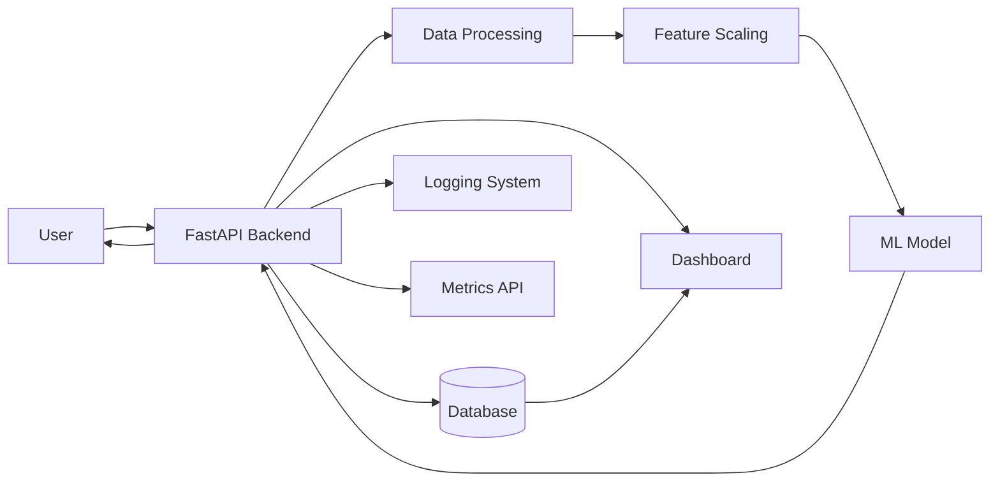

# 🚀 Real-Time Fraud Detection System

> Production-grade Machine Learning system for detecting fraudulent financial transactions in real-time.

---

## 📌 Overview

This project simulates a real-world fraud detection system used in fintech platforms.  
It processes transactions in real time, predicts fraud probability using Machine Learning, and logs results for monitoring and analytics.

---

## 🔥 Key Features

- ⚡ Real-time fraud prediction API using FastAPI
- 🧠 ML model with probability-based scoring
- 📊 Interactive dashboard using Streamlit
- 🗃️ Database logging using SQLAlchemy
- 📈 Fraud analytics and monitoring endpoints
- 🔍 Explainable AI (fallback-safe SHAP)
- 🐳 Dockerized deployment (production-ready)

---

## 🏗️ System Architecture


## ⚙️ Tech Stack

| Layer | Technology |
|------|-----------|
| Backend | FastAPI |
| Machine Learning | Scikit-learn |
| Database | SQLite + SQLAlchemy |
| Dashboard | Streamlit |
| Deployment | Docker |
| Language | Python |

---

## 🚀 API Endpoints

### 🔹 Predict Fraud

```http
POST /api/v1/predict

Request
{
  "amount": 50000,
  "oldbalanceOrg": 100,
  "newbalanceOrig": 0,
  "oldbalanceDest": 100,
  "newbalanceDest": 50000
}
Response
{
  "fraud_probability": 0.95,
  "is_fraud": true
}

🔹 Health Check
GET /health
🔹 Explain Prediction
POST /api/v1/explain
```

🖥️ Run Locally
```bash
git clone https://github.com/k-siddhartha-ai/real-time-fraud-detection-system.git
cd real-time-fraud-detection-system

pip install -r requirements.txt
uvicorn services.api.main:app --reload
```


🐳 Run with Docker
```bash
docker build -t fraud-app .
docker run -p 8000:8000 fraud-app
```

📊 Dashboard
```bash
streamlit run dashboard/app.py
```

📂 Project Structure
services/        → API & core backend  
ml/              → Model training & loading  
dashboard/       → Visualization UI  
streaming/       → Real-time simulation  

📈 Sample Output
{
  "fraud_probability": 0.957,
  "is_fraud": true
}

## 📸 Backend Demo

### Fraud Prediction API Output

****


🚀 Future Improvements
Kafka-based real-time streaming
Cloud deployment (AWS / GCP)
CI/CD pipelines
Model retraining automation

👨‍💻 Author

K. Siddhartha

⭐ If you like this project

Give it a ⭐ on GitHub
