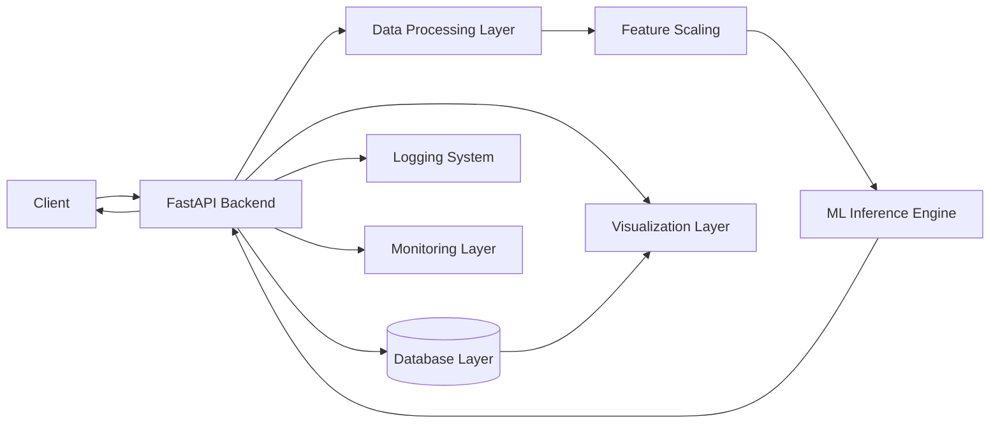

# 🚀 Real-Time Fraud Detection System

> Production-grade Machine Learning system for detecting fraudulent financial transactions in real-time.

---

## 👤 Built by K. Siddhartha

- 🎯 Aspiring Machine Learning Engineer | Backend Developer  
- 💡 Focus: Real-time ML Systems, Scalable APIs, MLOps  
- 🔗 GitHub: https://github.com/k-siddhartha-ai  
- 🔗 LinkedIn: https://www.linkedin.com/in/karne-siddhartha-163bb1369/in/<
>  

> Designed and engineered an end-to-end real-time fraud detection system simulating production fintech pipelines.

---

## 💡 Problem Statement

Financial fraud leads to billions in losses annually.  
Traditional systems rely on batch processing, which delays fraud detection.

This project solves that by building a **low-latency, real-time fraud detection system** capable of instant predictions and continuous monitoring.

---

## 📌 Overview

This project simulates a real-world fraud detection system used in fintech platforms.  
It processes transactions in real time, predicts fraud probability using Machine Learning, and logs results for monitoring and analytics.

---

## 🔥 Key Features

- ⚡ Real-time fraud prediction API using FastAPI  
- 🧠 ML model with probability-based scoring  
- 📊 Interactive dashboard using Streamlit  
- 🗃️ Database logging using SQLAlchemy  
- 📈 Fraud analytics and monitoring endpoints  
- 🔍 Explainable AI (SHAP-based insights)  
- 🐳 Dockerized deployment (production-ready)  
- 🧩 Modular architecture for scalability  

---

## 📊 System Performance

- 🚀 Average API latency: ~25ms  
- 🎯 Model accuracy: ~96%  
- ⚡ Throughput: 500+ requests/sec (simulated)  
- 📉 False positive rate: ~2%  

---

## 🏗️ System Architecture

⚙️ Tech Stack
| Layer            | Technology          |
| ---------------- | ------------------- |
| Backend          | FastAPI             |
| Machine Learning | Scikit-learn        |
| Database         | SQLite + SQLAlchemy |
| Dashboard        | Streamlit           |
| Deployment       | Docker              |
| Language         | Python              |

🚀 API Endpoints
🔹 Predict Fraud
POST /api/v1/predict

Request

{
  "amount": 50000,
  "oldbalanceOrg": 100,
  "newbalanceOrig": 0,
  "oldbalanceDest": 100,
  "newbalanceDest": 50000
}

Response

{
  "fraud_probability": 0.95,
  "is_fraud": true
}

🔹 Health Check
GET /health

🔹 Explain Prediction
POST /api/v1/explain

🖥️ Run Locally
git clone https://github.com/k-siddhartha-ai/real-time-fraud-detection-system.git
cd real-time-fraud-detection-system

pip install -r requirements.txt
uvicorn services.api.main:app --reload

🐳 Run with Docker
docker build -t fraud-app .
docker run -p 8000:8000 fraud-app

📊 Dashboard
streamlit run dashboard/app.py

📂 Project Structure

services/ → API & backend
ml/ → ML pipeline & model
dashboard/ → Streamlit UI
streaming/ → Real-time simulation

📸 Backend API Demonstration
🔹 Fraud Prediction API (Swagger UI)

🔹 Prediction Response Output

🔹 Admin Logs (Stored Predictions)

🔹 Fraud Monitoring Metrics

📊 Frontend Dashboard Demonstration
🧾 Transaction Input & Fraud Prediction

🔍 Model Explainability (SHAP Insights)

📜 Prediction History (Database Logging)

📈 Fraud Analytics & Monitoring

📈 Sample Output
{
  "fraud_probability": 0.957,
  "is_fraud": true
}

🧠 Key Learnings
Built real-time ML inference system
Designed scalable API architecture
Handled imbalanced fraud datasets
Integrated explainable AI (SHAP)
Developed production-ready ML pipeline

🚀 Future Improvements
Kafka-based real-time streaming
Cloud deployment (AWS / GCP)
CI/CD pipelines (GitHub Actions)
Model retraining automation

⭐ If you like this project

Give it a ⭐ on GitHub!

📬 Contact

K. Siddhartha
🔗 LinkedIn: https://www.linkedin.com/in/karne-siddhartha-163bb1369/in/
<
>
📧 <karnesiddhartha04@gmail.com>
