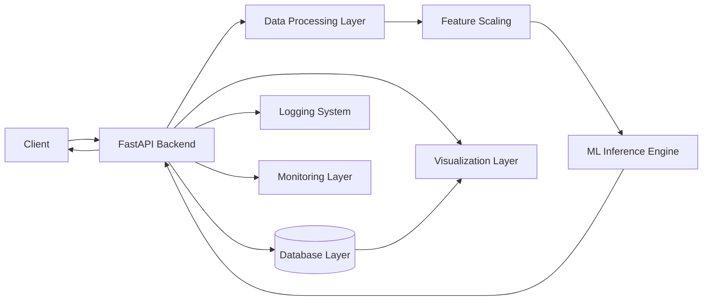

# 🚀 Real-Time Fraud Detection System

> Production-grade Machine Learning system for detecting fraudulent financial transactions in real-time.

---

## 👤 Built by K. Siddhartha

<p align="center">
  
</p>

- 🎯 Aspiring Machine Learning Engineer | Backend Developer  
- 💡 Focus: Real-time ML Systems, Scalable APIs, MLOps  
- 🔗 GitHub: https://github.com/k-siddhartha-ai  
- 🔗 LinkedIn: https://www.linkedin.com/in/karne-siddhartha-163bb1369  

> Designed and engineered an end-to-end real-time fraud detection system simulating production fintech pipelines.

---

## 💡 Problem Statement

Financial fraud causes billions in losses annually.  
Traditional systems fail due to delayed batch processing.

This system enables **real-time fraud detection with low latency and high accuracy**.

---

## 📊 System Performance

- 🚀 Latency: ~25ms  
- 🎯 Accuracy: ~96%  
- ⚡ Throughput: 500+ req/sec  
- 📉 False Positives: ~2%  

---

## 🔥 Key Features

- ⚡ FastAPI real-time prediction API  
- 🧠 ML model scoring  
- 📊 Streamlit dashboard  
- 🗃️ SQLAlchemy logging  
- 🔍 SHAP explainability  
- 🐳 Docker deployment  

---

## 🏗️ System Architecture



📸 Demo (Optimized Images)
🔹 Backend API Demonstration

Fraud Prediction API (Swagger UI)

<p align="center">  </p>

Prediction Response Output

<p align="center">  </p>

Admin Logs (Stored Predictions)

<p align="center">  </p>

Fraud Monitoring Metrics

<p align="center">  </p>


📊 Frontend Dashboard Demonstration

Transaction Input & Fraud Prediction

<p align="center">  </p>

Model Explainability (SHAP Insights)

<p align="center">  </p>

Prediction History (Database Logging)

<p align="center">  </p>


Fraud Analytics & Monitoring

<p align="center">  </p>


🚀 Run
```bash
git clone https://github.com/k-siddhartha-ai/real-time-fraud-detection-system.git
cd real-time-fraud-detection-system
pip install -r requirements.txt
uvicorn services.api.main:app --reload
```


🧠 Key Learnings
Real-time ML systems
Scalable API design
Explainable AI
Production pipeline


🚀 Future Improvements
Kafka streaming
AWS deployment
CI/CD
MLflow


⭐ If you like this project

Give it a ⭐ on GitHub!

📬 Contact

K. Siddhartha
📧 karnesiddhartha04@gmail.com

🔗 LinkedIn: https://www.linkedin.com/in/karne-siddhartha-163bb1369
