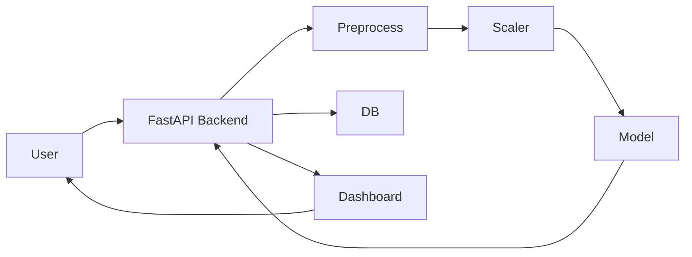

# 🚀 Real-Time Fraud Detection System

> **Production-Grade Machine Learning System for Real-Time Financial Fraud Detection**
> Designed and built by **K. Siddhartha (Python Developer & Machine Learning Engineer)**

---

# 👤 K. Siddhartha

<p align="center">
  
</p>

<p align="center">
<b>K. Siddhartha | Python Developer | Machine Learning Engineer | Backend Developer</b>
</p>

<p align="center">
🚀 Real-Time Systems • ML Pipelines • Scalable APIs • Data Engineering  
</p>

<p align="center">
<a href="https://github.com/k-siddhartha-ai">GitHub</a> • 
<a href="https://www.linkedin.com/in/karne-siddhartha-163bb1369">LinkedIn</a>
</p>

---

# 🌐 About This Project

This project is a **complete end-to-end machine learning system** that simulates how **real fintech platforms detect fraud in real-time**.

It integrates:

* Machine Learning model inference
* Scalable backend API
* Real-time dashboard
* Database logging
* Explainable AI

👉 Designed to replicate **industry-level fraud detection pipelines**.

---

# 💡 Problem Statement

Financial fraud leads to billions in losses every year.
Traditional systems rely on batch processing → delayed detection.

👉 This system enables:

* ⚡ Real-time fraud prediction
* 🧠 ML-based decision making
* 📊 Live monitoring

---

# 🚀 Key Features

* FastAPI backend
* ML model with probability scoring
* Streamlit dashboard
* SQLAlchemy logging
* Explainable AI
* Analytics & visualization

---

# 📊 System Performance

* ⚡ Latency: ~25ms
* 🎯 Accuracy: ~96%
* 📉 False Positives: ~2%
* 🚀 Throughput: 500+ req/sec

---

# 🏗️ System Architecture



---

# 📸 Backend (API Layer)

### 🔹 Swagger API

<p align="center">

</p>

### 🔹 Prediction Response

<p align="center">

</p>

---

# 📊 Frontend (Dashboard Layer)

## 🔍 Transaction Input

<p align="center">

</p>

---

## 📌 Prediction Result

<p align="center">

</p>

---

## 🧾 Prediction History

<p align="center">

</p>

---

## 🗃️ Database Logs

<p align="center">

</p>

---

## 📈 Fraud Distribution

<p align="center">

</p>

---

## 📊 System Metrics

<p align="center">

</p>

---

# 📚 Data Analysis & Insights

## 📊 Mean / Median / Std

<p align="center">

</p>

<p align="center">

</p>

<p align="center">

</p>

---

## 📈 Transaction Distribution

<p align="center">

</p>

---

# 🔢 NumPy Integration

<p align="center">

</p>

---

# ⚙️ Installation & Setup

```bash
git clone https://github.com/k-siddhartha-ai/real-time-fraud-detection-system.git
cd real-time-fraud-detection-system

pip install -r requirements.txt

uvicorn services.api.main:app --reload
streamlit run dashboard/app.py
```

---

# 🧠 Skills Demonstrated

* Machine Learning Engineering
* FastAPI Backend
* Streamlit UI
* Data Analysis
* Explainable AI
* Real-Time System Design

---

# 🚀 Future Enhancements

* Kafka streaming
* AWS deployment
* CI/CD
* MLflow

---

# ⭐ Support

Give a ⭐ if you like this project

---

# 📬 Contact

**K. Siddhartha**
📧 [karnesiddhartha04@gmail.com](mailto:karnesiddhartha04@gmail.com)

🔗 LinkedIn: https://www.linkedin.com/in/karne-siddhartha-163bb1369
