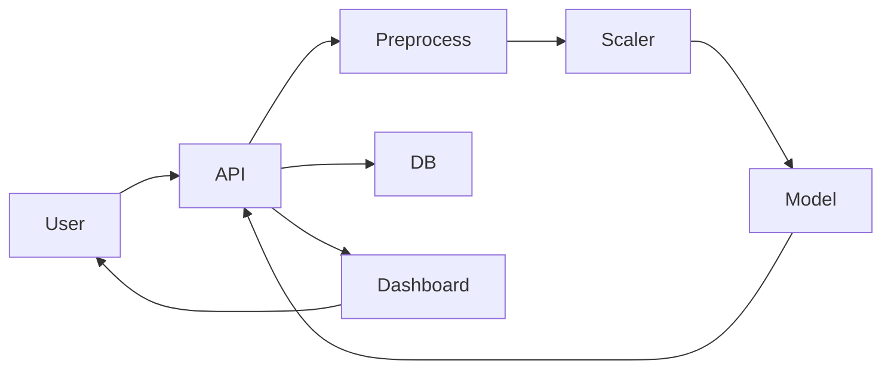

# 🚀 Real-Time Fraud Detection System

> **Production-Grade Machine Learning System for Real-Time Financial Fraud Detection**
> Built using FastAPI, Streamlit, and Scalable ML Architecture

---

# 👤 K. Siddhartha

<p align="center">
  
</p>

<p align="center">
<b>Python Developer | Machine Learning Engineer | Backend Developer</b>
</p>

<p align="center">
🚀 Real-Time Systems • ML Pipelines • Scalable APIs  
</p>

<p align="center">
<a href="https://github.com/k-siddhartha-ai">GitHub</a> • 
<a href="https://www.linkedin.com/in/karne-siddhartha-163bb1369">LinkedIn</a>
</p>

---

# 🌐 About Me

I am **K. Siddhartha**, a Python Developer and Machine Learning Engineer specializing in building **real-time AI systems, scalable backend APIs, and production-grade ML pipelines**.

---

# 💡 Problem Statement

Financial fraud causes massive losses.
Traditional systems fail due to delayed detection.

👉 This system enables:

* ⚡ Real-time fraud detection
* 🧠 ML-based predictions
* 📊 Live monitoring

---

# 🚀 Features

* ⚡ FastAPI backend
* 🧠 ML prediction pipeline
* 📊 Streamlit dashboard
* 🗃️ Database logging
* 🔍 Explainable AI
* 📈 Data analytics

---

# 🏗️ Architecture



---

# 📸 Backend API

### Swagger API

<p align="center">

</p>

### Prediction Output

<p align="center">

</p>

---

# 📊 Frontend Dashboard (Complete Outputs)

## 🔍 Transaction Input UI

<p align="center">


" />
" width="75%" />
</p>

---

## 📌 Prediction Result (Fraud Detection)
<p align="center">

" width="75%" />
</p>

---

## 🧾 Local Prediction History

<p align="center">


" width="75%" />
</p>

---

## 🗃️ Database Prediction Logs

<p align="center">

</p>

---

## 📈 Fraud Probability Distribution

<p align="center">

</p>

---

## 📊 Fraud Statistics Dashboard

<p align="center">

</p>

---

# 📚 Data Analysis (Syllabus Section)

## 📊 Mean

<p align="center">


" width="75%" />
</p>

## 📊 Median

<p align="center">


" width="75%" />
</p>

## 📊 Standard Deviation

<p align="center">


" width="75%" />
</p>

---

# 🔢 NumPy Demo

<p align="center">


" width="60%" />
</p>

---

# ⚙️ Run Project

```bash
git clone https://github.com/k-siddhartha-ai/real-time-fraud-detection-system.git
cd real-time-fraud-detection-system

pip install -r requirements.txt

uvicorn services.api.main:app --reload
streamlit run dashboard/app.py
```

---

# 🧠 Skills Demonstrated

* Machine Learning
* FastAPI Backend Development
* Streamlit UI
* Data Analysis
* Explainable AI
* Real-Time Systems

---

# 🚀 Future Improvements

* Kafka Streaming
* AWS Deployment
* CI/CD
* MLflow

---

# ⭐ Support

Give a ⭐ if you like this project

---

# 📬 Contact

**K. Siddhartha**
📧 [karnesiddhartha04@gmail.com](mailto:karnesiddhartha04@gmail.com)

🔗 LinkedIn: https://www.linkedin.com/in/karne-siddhartha-163bb1369
