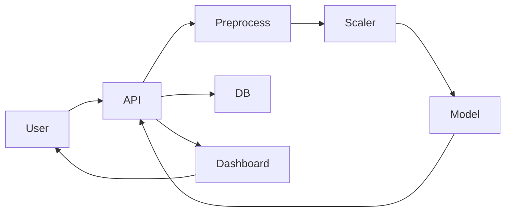

# 🚀 Real-Time Fraud Detection System

> **Production-Grade Machine Learning System for Real-Time Financial Fraud Detection**
> Built using FastAPI, Streamlit, and Scalable ML Architecture

---

# 👤 K. Siddhartha

<p align="center">
  
</p>

<p align="center">
<b>Python Developer | Machine Learning Engineer | Backend Developer</b>
</p>

<p align="center">
🚀 Real-Time Systems • ML Pipelines • Scalable APIs  
</p>

<p align="center">
<a href="https://github.com/k-siddhartha-ai">GitHub</a> • 
<a href="https://www.linkedin.com/in/karne-siddhartha-163bb1369">LinkedIn</a>
</p>

---

# 🌐 About Me (SEO Optimized)

I am **K. Siddhartha**, a Python Developer and Machine Learning Engineer specializing in building **real-time AI systems, scalable backend APIs, and production-grade ML pipelines**.

This project demonstrates my ability to design **end-to-end machine learning systems used in fintech fraud detection**, combining backend engineering, data science, and system design.

---

# 💡 Problem Statement

Financial fraud results in billions of losses annually.
Traditional systems fail due to **delayed batch processing**.

👉 This system enables:

* ⚡ Real-time fraud detection
* 🧠 ML-based decision making
* 📊 Live monitoring dashboard

---

# 🚀 System Highlights

| Capability     | Technology   |
| -------------- | ------------ |
| Real-time API  | FastAPI      |
| ML Model       | Scikit-learn |
| Dashboard      | Streamlit    |
| Database       | SQLAlchemy   |
| Explainability | SHAP         |
| Deployment     | Docker       |

---

# 📊 Performance

* ⚡ Latency: ~25ms
* 🎯 Accuracy: ~96%
* 📉 False Positives: ~2%
* 🚀 Throughput: 500+ req/sec

---

# 🏗️ Architecture



---

# 📸 Backend API

### Fraud Prediction API

<p align="center">

</p>

### Prediction Output

<p align="center">

</p>

---

# 📊 Frontend Dashboard

### Transaction Prediction UI

<p align="center">

</p>

### Prediction Output

<p align="center">

</p>

### Local History

<p align="center">

</p>

### Database Logs

<p align="center">

</p>

### Analytics

<p align="center">

</p>

### System Stats

<p align="center">

</p>

---

# 📚 Data Analysis

<p align="center">

</p>

<p align="center">

</p>

<p align="center">

</p>

---

# 🔢 NumPy Demo

<p align="center">

</p>

---

# ⚙️ Run Project

```bash
git clone https://github.com/k-siddhartha-ai/real-time-fraud-detection-system.git
cd real-time-fraud-detection-system

pip install -r requirements.txt

uvicorn services.api.main:app --reload
streamlit run dashboard/app.py
```

---

# 🧠 Skills Demonstrated

* Machine Learning Engineering
* Backend API Development
* Data Processing Pipelines
* Explainable AI
* Real-Time System Design

---

# 🚀 Future Scope

* Kafka Streaming
* AWS Deployment
* CI/CD Pipelines
* MLflow Integration

---

# ⭐ Support

Give a ⭐ if this project helped you

---

# 📬 Contact

**K. Siddhartha**
📧 [karnesiddhartha04@gmail.com](mailto:karnesiddhartha04@gmail.com)

🔗 LinkedIn: https://www.linkedin.com/in/karne-siddhartha-163bb1369
